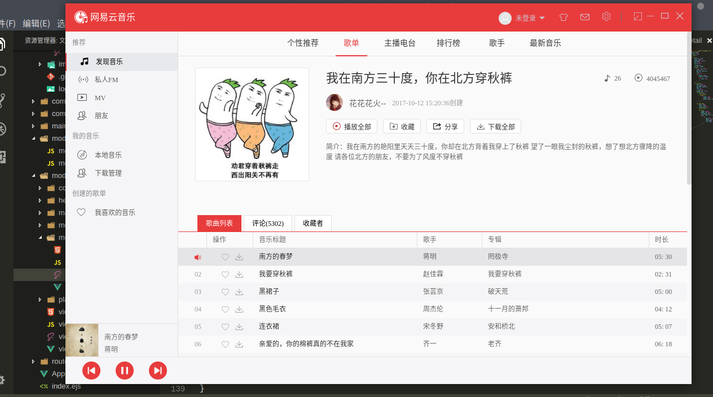
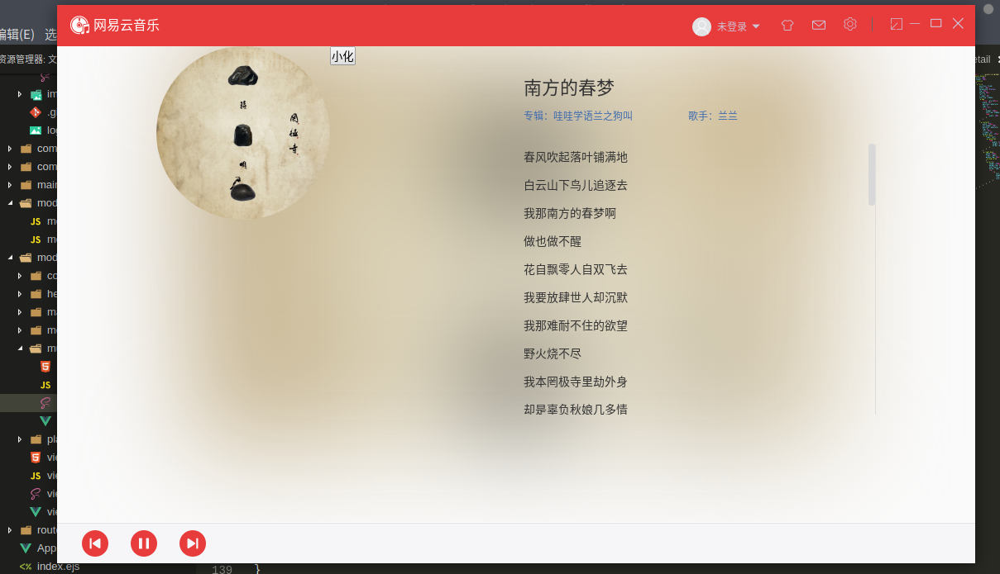

# cloud-music

> electron-vue 网易云音乐

###### 接口
```
https://github.com/Binaryify/NeteaseCloudMusicApi.git
```

#### Build Setup

``` bash
# 安装依赖
npm i

# 运行
npm start

```

---

###### 预览






This project was generated with [electron-vue](https://github.com/SimulatedGREG/electron-vue) using [vue-cli](https://github.com/vuejs/vue-cli). Documentation about the original structure can be found [here](https://simulatedgreg.gitbooks.io/electron-vue/content/index.html).
